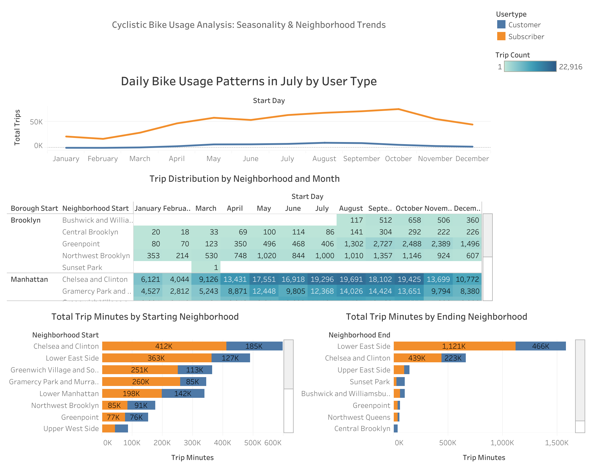

# 🚴 Cyclistic Bike-Share Analysis

**Business Intelligence Project | Google Business Intelligence Certificate**

---

## 📌 Executive Summary
This project analyzes bike-share usage data from Cyclistic to uncover customer behavior patterns and support strategic decision-making.

Through data analysis and interactive dashboards, the project identifies differences between subscribers and casual riders, highlights seasonal demand trends, and provides actionable insights to improve customer growth and station optimization.

---

## 🎯 Business Problem
Cyclistic aims to increase its customer base and improve station expansion decisions.

**Key Question:**  
How are subscribers vs. casual riders using Cyclistic bikes across time and location, and how can these insights drive business growth and operational efficiency?

---

## ⚙️ Methodology
The project follows a structured Business Intelligence workflow:

1. **Business Understanding**
   - Defined stakeholder needs and project requirements  
   - Identified key performance metrics  

2. **Data Preparation**
   - Cleaned and validated trip datasets  
   - Combined seasonal and yearly data  

3. **Data Analysis**
   - Analyzed trip patterns by user type, location, and time  
   - Evaluated demand trends and congestion  

4. **Visualization**
   - Built an interactive dashboard using Tableau  
   - Designed charts to highlight trends and comparisons  

5. **Insight Generation**
   - Extracted key findings  
   - Developed business recommendations  

---

## 📊 Dashboard

👉 **Interactive Dashboard:**  
https://public.tableau.com/app/profile/niranjan.k.c5704/viz/CyclisticBikeUsageAnalysisSeasonalityNeighborhoodTrends/CyclisticBikeUsageAnalysisSeasonalityNeighborhoodTrends

---

## 📈 Key Insights
- Subscriber usage is consistently higher than casual riders  
- Peak demand occurs during summer months (May–October)  
- High-demand neighborhoods include Chelsea and Lower East Side  
- Strong commuter behavior among subscribers  
- Congestion patterns indicate need for better bike distribution  

---

## 💡 Business Recommendations
- Expand stations in high-demand areas  
- Convert casual riders into subscribers through targeted campaigns  
- Optimize bike allocation based on seasonal demand  
- Use time-based insights for operational planning  

---

## 🛠️ Skills Demonstrated
- Data Analysis  
- Data Cleaning & Preparation  
- Tableau Dashboard Development  
- Business Intelligence Reporting  
- Stakeholder Requirement Analysis  
- Insight Communication  

---

## 📁 Dataset
- cyclistic_summer_trips.csv  
- cyclistic_yearly_trips.csv  

---

## 📄 Project Documentation
- Stakeholder Requirements Document  
- Project Requirements Document  

Available in `/docs` folder.

---

## 🎓 Certification
This project was completed as part of the **Google Business Intelligence Professional Certificate**.

📜 https://www.coursera.org/account/accomplishments/professional-cert/AWYCUXUYVCNC

---

## 👤 Author
**Niranjan K C**  
Aspiring Data Analyst  
https://www.linkedin.com/in/niranjan-k-c-44681334/
